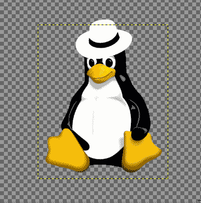

# I. Prologue
## What is the Pindorama project?
*Adapted and translated to english from the [website](http://pindorama.twilightparadox.com/):*  
> Pindorama is a project that produces **FREE** and intelligent software,
> following principles of modularity, simplicity and sanity.
> It started (and still being) something personal and hobistic from a group of
> friends, who started the project around the end of June 2019.  
> We seek to maintain sanity and competence as a proudly Brazilian open-source project.

## What is Copacabana Linux?

## How did Pindorama started?

### The "INU Project"
**Everything** goes back when I, Luiz Antônio (`takusuman`), started using Linux, at the end of 
2018. It was everything new, I was just getting out of the "VirtualBox Plato's cave" and
started using Linux on bare metal.  
In that same year, I met Caio Novais (`chexier`), 
which at the first moment wasn't *exactly* my friend --- in fact, we just used to start flame wars 
about computing  (more specifically, about Linux) in a forum, with no further intent besides 
trolling each other -- but, later on, we became friends and started thinking about starting an 
open-source project or something (although having almost no knowledge about programming). So
we, two 13 year old brats, created a GitHub profile and start doing some really amateur scripts.  
The name of our """project""" was INU, an obvious pun on the name GNU.  
I think it was a good start, because although our code being, at the time, really amateur, we
learnt a lot --- not nearly as much as we would be still learning until today, but it was a start.  

We didn't had a lot of significant activity until something between June or July
2019, when we trew "INU" away and started Pindorama, so I will skip part of the
year of 2019 here.

### The genesis of Pindorama

#### How a blowed up power supply and an old business laptop opened frontiers 
In mid May 2019, my computer's power supply just blew up (it was what we call "fonte bomba"
here in Brazil, literally "bomb power supply", so i was, in some way, expecting it to happen);
so, while I haven't enough money to fix it, I had to use an old Lenovo G450 --- 
which ran Windows 7, and for some reason, although being "designed to run Windows
7", it was terribly slow; so I was going to need to run Linux on bare metal again.  
Cool, eh? No, it wasn't.  
Since the laptop wasn't *really* mine, I couldn't just overwrite 
the Windows partition with Linux, so I was going to need to use a Live environment.  
The one that I (negatively) remember the most is [antiX Linux](http://antixlinux.com/).
I can describe it simply as being a Debian rebrand with some hacks made using
Python (plus PyQt) and Shell that made the distribution even worse (in the sense of
being rigid) to use.
In short, it seemed that the author was more concerned with doing some kind of 
political activism against the USA/"The West", liberalism/capitalism and corporations 
(in special Red Hat *et caterva*) rather than making an usable Linux live distribution.  
I don't want to be an elitist bastard here, the main idea is really good, but it was 
unfortunately poorly executed and blind by political ideals.  
By the way, the last time I've booted antiX was in somewhere between March and
June 2019, so it may have changed a lot since then. I also hope I haven't offended the
creators as individuals, because they seem like really nice people.  

So, after suffering for a while, I've called `chexier` and talked about creating a
Devuan remix (in brazilian software communities, it's called a "refisefuquis") for 
running from a pendrive or a CD-ROM and that I could run in any x86 machine
(including the ones from my school, that at the time were avaible to all students
at the institution). It never was our goal to debunk antiX (and we didn't made it anyway), 
we just wanted to have a decent Linux live system to use --- and, at the time, I wanted to 
improve my knowledge on programming until I fixed my main computer and I didn't
wanted to use Windows for that.  
And ==it's here where Pindorama starts==, with a Devuan *refisefuquis* called 
"São Jorge GNU+Linux".  

#### Operation: São Jorge GNU+Linux
[{ align="right" width="340" }](../img/sao_jorge_gnulinux.png)
It was the night of June 27, 2019, and there was me, `chexier` and Kayo Henrique
(`tamboru`), a cool m8 who I've met some weeks before and which offered 
to help with artworks.  
Although being something made just for our (more specifically my) personal use,
we were sure to release it to the public --- not because of ego or something, but
because we were really inspired.  

For contextualizing our inspiration, I need to talk about Pindorama in terms of
politics.  
We started as a somewhat nationalist project. Some people out there may would call us
(cripto-)fascists, but we didn't (and still don't) saw our actions this way.  
[{ width="500" }](../img/nationalism.jpg)  
We were really inspired, mainly by speeches coming from respected people within
the F/L/OSS community in Brazil, such as Carlos Morimoto and Júlio Cezar Neves.  
One of the speeches/interviews that inspired us the most was one [given by
Morimoto to Infomedia somewhere between 2007](http://youtu.be/-UvJj74DDm4), in 
which he talks about how and why he developed Kurumin Linux; there's a remarkable
quote at 3m14s:
> [...] *But as I said, it was a personal project [inaudible] CD from Guia do Hardware,
> but ==following the open-source philosophy I [decided] to release it on the Web; if 
> anyone wants it or thinks that it's useful, they can use it==* [...]

We pulled an all-nighter installing and configuring Devuan ASCII on VirtualBox --- unless 
you're an anti-VM pseudo-intelectual, making a *refisefuquis* distribution using SystemBack
on bare-metal doesn't make any pratical sense --- using `chexier`'s machine as host (since
mine doesn't have VMX instructions).  
[{ align="left" width="200" }](../img/vinicius.png)
In meanwhile, `tamboru` was designing the logo and the mascot; our old logo was
inspired on Slackware's one, and the mascot was (and still being) Tux dressed as 
[Zé Pilintra](https://en.wikipedia.org/wiki/Z%C3%A9_Pilintra) and smoking a brown pipe; 
we named him "Vinícius" after the poet Vinícius de Moraes.  

At the time, we didn't coded anything for it, both because we didn't had so much
knowledge and experience with programming and because we hadn't the need.  
The only thing that we coded was a script that would run on 
a Devuan minimal environment, installed all the needed packages and did the
transition from SysVinit to OpenRC (using a `for` loop that stopped every single
SysVinit service and then restarted the system using `/sbin/init 6`); and,
looking at it from today's perspective, I can say it was a pile of cheap Shell
script hacks that "just worked"... and I also can say that it was the first
actually useful thing that we've coded.  

I'm not going to make it sounds epic here: except for `tamboru`'s artistic work,
it was a kinda mediocre distribution if we compare, for example, with Knoppix.
It was somehow better than antiX, but it lacked a lot of configuration and polishing 
--- something remarkable was the fact that the system's clock was always set to 
have its timezone on Rio de Janeiro, because we just didn't knew about the 
existence of `ntpd`(8) --- and we didn't minded that, mostly because I was the
only person actually using it, we didn't set up `rc_parallel` and didn't even put
"Bem-vindo ao Pindorama São Jorge 0.0.X" written at `motd`(5) --- it was 
a filthy hack at `.profile` using `echo`(1) which printed that message everytime
the user logged in or opened a X terminal.  

The desktop was basically LXQt combined with WindowMaker using Bluecurve icons, 
the visual (console) text editor was vi.l.e ("`vi` like `emacs`"), the default
web browser was Pale Moon and the init system was OpenRC. 
That's only what I can be sure that I recall correctly.  

Unfortunately, it's lost in time. No one in the project still have the disk
images saved.  
I remember giving a CD-ROM containing São Jorge 0.0.3 to an italian friend --- 
which was at the time studying as an exchange student --- at the beginning of my
1st year of High School (somewhere between March 2020) so it *may* still exists
in some place. 

#### Morimoto Said Release It Out! 
<figure markdown>
[{ width="550" }](../img/20190922_012134.jpg)
<figcaption>São Jorge 0.0.3 (?) booted on chexier's laptop at 22th September 2019</figcaption>
</figure>
Right after we """compiled""" (in fact just generated an `.iso` with SystemBack) 
and uploaded the 0.0.2 version to `chexier`'s GDrive account, I went straight to
Viva ao Linux, a brazilian \*NIX-dedicated forum, and made a post about our new
*refisefuquis*.  

*The original post, in portuguese:*
> *1. PINDORAMA LINUX, A NOSSA TENTATIVA DE REVIVER O ESPÍRITO KURUMIN DE UMA
> DISTRIBUIÇÃO BRASILEIRA!  
> Enviado em 24/06/2019 - 19:06h  
> Olá internautas, tudo bem?  
> Eu gostaria de pedir reforços para a criação do Pindorama Linux, distribuição
> essa que visa ressuscitar o nosso velho Kurumin.  
> Precisamos de programadores Shell Script, C, C++, Java e Python.  
> Não pretendemos pagar ninguém, isso é apenas um projeto colaborativo, assim
> como era o Kurumin.  
> Se quiserem mais informações, nos chamem pelo email do projeto: pindoramalinux@420blaze.it  
> Muito obrigado pela atenção.  
> Sou novo aqui, então não sei se postei corretamente.*  

The reactions were mixed, some said "This project is born dead."
and others said "Go ahead! A dream you guys dream together will be reality.";
and, in fact, both were right: Pindorama could be just another refisefuquis
which would be dead some weeks after the first release, but it also could evolve
into something relevant, it is in our hands.  
So we decided together: we will try to improve our knowledge in programming for,
in the future, do something interesting.  
`chexier` chose Python, I chose Shell and `tamboru` chose Linux administration
via CLI --- which wasn't programming, but it would eventually be useful when
helping us to test new \*NIX-related projects.  
We also decided to create a website and host at Neocities, because it would help
us both to reach more people and learn HTML as a markup language.  
In the meanwhile, I met some cool m8s at [Liga dos Programadores](https://liga-dos-programadores.github.io/) 
(lit. "Programmer's League"), who eventually would help me to improve my
knowledges; one m8 that I remember being a good friend and a good programmer is
Gabriel P. Monte (`gabe`), who really helped me with the coding of the first
website; he even registered the process of coding it on a livestream, but
unfortunately it's lost in time, since he deleted his Twitch account with all
the clips made. The exactly original website is also lost, but I used some of
its assets to create the "404 handling" page when you try to access our old
Neocities website, with a new codebase made entirely by me, as a tribute to the
past.  
Some weeks later, Salatiel (`SalatielSauer`), a friend from another server,
remade `gabe`'s website using JavaScript, implemented features such as menus
and topics and a completely new layout, different from the plain-text-like made
by `gabe`.  

### The Dark Ages of Pindorama
2019 ended pretty well, both for our private lives and for Pindorama. We had plans and
new ideas, but then it came 2020...  
Me and `chexier` started having plans to built a Linux From Scratch-based
distribution, only using OpenBSD tools and Musl libc, it'd be called "Kurumin"
after Morimoto's Kurumin Linux --- what would eventually be changed later 
after I thought more about it and saw it was a pretty bad idea --- but,
unfortunately (or fortunately, since we didn't in fact knew yet what we'd
do), [`chexier` was distro-hopping a lot](../img/chexier_distro-hopping.png), so we didn't had a fixed and stable
host to compile everything from the start to the finish, and we ended up doing
nothing related in fact to the distribution binary compilation in 2020.  
I even remember he trying to compile Linux From Scratch using OpenBSD as host.
Obviously, it went wrong because neither me nor him knew what in fact was and
how to do a cross-compilation in the right way.  

I'll skip to April 2020, when the Coronavirus pandemic started in Brazil,
along with what I'll be calling "The Dark Ages of Pindorama".  

Things started to get darker and darker every month passed; me and `chexier` were
having multiple unnecessary face-offs because of futiles things (for example, 
"GNU/bash vs. POSIX/sh" --- everyone knows that AT&T/ksh93, Bell Labs/rc or
a compiled language such as Go is better anyway, but we were discussing about 
this), and, in some way, this wore out the project and the quality of our work
--- Otto is, unfortunately, victim of all this darkness. Instead of studying how
to do a decent package manager (and figuring out that it would be better to made
it with Go, Nim or even C instead of Shell), we were just discussing.  

The worst thing: all of these discussions
were fueled by so-called "memes" from 4chan --- for example: `chexier`
saw someone saying that W and Z rocks, so he came and said "screw X and Y, we're
going to use W and Z" ***sends screenshot of some 4chan thread saying that X and Y
are crap, probably made by a millennial who didn't ever coded something relevant
or useful in his life or by a 30 year old man that lives in his mother's house,
has autism, is unemployed, reads and repeats Nietzche and only do shitty theorical
C programs to prove himself as an "intellectual"*** --- ==after all, it's really easy
to belittle an entire team's work of weeks, months or even years (like what was 
done with BSD communities on 4chan in 2020) when you don't do anything by yourself,
not even saying exactly what's wrong with who you're criticizing or just making
fun of==. 
 
"Well, in the end, competition and discussions are always good", people usually say.  
Well, they'd be completely right... if at least one of we two were at commmitted
to learn at least the basic differences between X, Y, W and Z and how to in fact 
use them before switching; which didn't happened, mostly because of the effects 
caused by the COVID-19 social isolation, that include ==depression==. Obviously,
it wasn't only the pandemic that made us sick, ==it was also immaturity from both
sides== and the World, in general, was mentally sick --- suffering from an "Internet
overdose", a post-Enlightenment, where everything is a "shitpost" or "meme",
fueled by a shitty nihilism (maybe this is pleonasm, but anyway).   
Has humanity got worse? No, it just took the wrong path, we can and will fix it.  

Another really annoying problem that happened in 2020 was being besieged by 
thirsty opportunists wanting someone to be their servants:
> *"Hey, why don't you learn C effectively and come help me in my Discord server?  
> I'm starting a project that is promising, but for this I need a programmer that
> isn't tied to any other project and R$ 20,00 in Bitcoin  
> So drop this Pindorama away and deposit R$ 20,00, this will be great. You're a
> genius and I need more people like you!"*  

Usually they tried to (unsuccessfully) convey an image of intellectualism --- like
doing a matrix multiplier program using C in the front of your eyes, por example
--- but at the same time they commited stupid portuguese mistakes that an
"intellectual", as they claimed to be, couldn't commit.  

I didn't fell for that, obviously, but it annoyed me a lot anyway.  

In fact, pseudo-intelectualism and pseudo-science are the worst things ever,
because unlike plain hoaxes, they look and have bases to claim being real
until you find the in fact real information; it's like half-truths.  

In contrast to futile discussions fueled by cheap pseudo-intelectualism, I
actually have seen people working so that the project won't be weakened, such as
`tamboru` elaborating new artworks and even a new contributor, a cool m8 from
São Paulo called Vitor Almeida (`vit0rr`) offering to help in the website ---
by the way, the current website was entirely made by him, so if we don't look
like stuck in 1999 anymore, all kudos goes to him --- so the only thing that 
I can't, under any circumstances, affirm is that the project "almost died
because anyone was giving it attention".  

As history is cyclical, my only fear is that we could fall into this
darkness again and don't even notice.  

In short: pseudo-intelectualism/pseudo-science and futile "technical"
discussions are considered harmful.  

### give me light!

## Why is Copacabana being created now?
