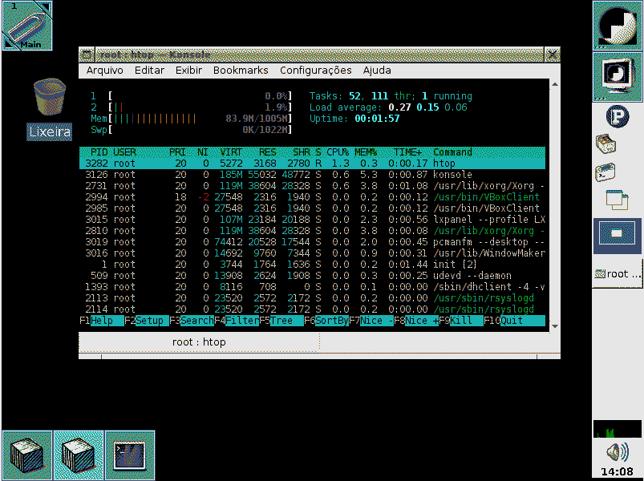

# Introduction
## What is the Pindorama project?
*Translated to english from the [website](http://pindorama.twilightparadox.com/):*  
> Pindorama is a project that produces **FREE** and intelligent software,
> following principles of modularity, simplicity and sanity.
> It started (and still being) something personal and hobistic from a group of
> friends, who started the project around the end of June 2019.
> We seek to maintain sanity and competence as a proudly Brazilian open-source project.

## What is Copacabana Linux?

## How did Pindorama started?
### The "INU Project"
**Everything** goes back when I, Luiz Antônio (`takusuman`), started using Linux, in the end of 
2018. It was everything new, I was just getting out of the "VirtualBox Plato's cave" and
started using Linux on bare metal.  
In that same year, I met Caio Novais (`chexier`), 
which at the first time wasn't *exactly* my friend --- in fact, we just used to start flame wars 
about computing  (more specifically, about Linux) in a forum, with no further intent besides 
trolling each other -- but, later on, we became friends and started thinking about starting an 
open-source project or something (althought having almost no knowledge about programming), so
we, two 13 year old brats, created a GitHub profile and start doing some really amateur scripts. 
At the time, the name of our """project""" was INU, an obvious pun on the name GNU.  
I think it was a good start, because although our code being, at the time, really amateur, we
learnt a lot --- not nearly as much as we would be still learning until today, but it was a start.  

We didn't had a lot of significant activity until something between June or July
2019, when we trew "INU" away and started Pindorama, so I will skip part of the
year of 2019 here.

### The genesis of Pindorama

#### How a blowed up power supply and an old business laptop opened frontiers 
In mid May 2019, my computer's power supply just blew up (it was what we call "fonte bomba"
here in Brazil, literally "bomb power supply", so i was, in some way, expecting it to happen);
so, while I haven't enough money to fix it, I had to use an old Lenovo G450 --- 
which ran Windows 7, and for some reason, although being "designed to run Windows
7", it was terribly slow; so I was going to need to run Linux on bare metal again.  
Cool, eh? No, it wasn't.  
Since the laptop wasn't *really* mine, I couldn't just overwrite 
the Windows partition with Linux, so I was going to need to use a Live environment.  
The one that I (negatively) remember the most is [antiX Linux](http://antixlinux.com/).
I can describe it simply as being a Debian rebrand with some hacks made using
Python (plus PyQt) and Shell that made the distribution even worse (in the sense of
being rigid) to use.
In short, it seemed that the author was more concerned with doing some kind of 
political activism against the USA/"The West", liberalism/capitalism and corporations 
(in special Red Hat *et caterva*) rather than making an usable Linux live distribution.  
I don't want to be an elitist bastard here, the main idea is really good, but it was 
unfortunately poorly executed and blind by political ideals.  
So, after suffering for a while, I've called `chexier` and talked about creating a
Debian remix (in brazilian software communities, it's called a "refisefuquis") for 
running from a pendrive or a CD-ROM and that I could run in any x86 machine
(including the ones from my school, that at the time were avaible to all students
at the institution). It never was our goal to debunk antiX (and we didn't made it anyway), 
we just wanted to have a decent Linux live system to use --- and, at the time, I wanted to 
improve my knowledge on programming until I fixed my main computer and I didn't
wanted to use Windows for that.  
And it's here where the "Pindorama Project" starts, with this Devuan
*refisefuquis* called "São Jorge GNU+Linux".  

#### Operation: São Jorge GNU+Linux
[{ align=right width=400 }](../img/sao_jorge_gnulinux.png)
It was the night of June 30, 2019, and there was me, `chexier` and Kayo Henrique
(`tamboru`), a cool m8 who I've met some months before and which offered 
himself to help with artworks.  
Although being something made just for our (more specifically my) personal use,
we were sure to release it to the public --- not because of ego or something, but
because we were really inspired.  
We started as a somewhat nationalist project. Some people out there may would call us
cripto-fascists at the time, but I didn't (and still don't) saw our actions this way.  
We were really inspired, mainly by speeches coming from respected people within
the F/L/OSS community in Brazil, such as Carlos Morimoto and Júlio Cezar Neves.  
One of the speeches/interviews that inspired us the most was one [given by
Morimoto to Infomedia in somewhere between 2007](http://youtu.be/-UvJj74DDm4), in 
which he talks about how and why he developed Kurumin Linux, but there's a
remarkable quote at 3m14s:
> [...] *But as I said, it was a personal project [inaudible] CD from Guia do Hardware,
> but following the open-source philosophy I [decided] to release it
> on the Web; if anyone wants or thinks that it's useful, they can use it* [...]

That was **the** morale booster to us three.  

We pulled an all-nighter installing and configuring Devuan in VirtualBox --- unless 
you're an anti-VM pseudo-intelectual, making a *refisefuquis* distribution using SystemBack
on bare-metal doesn't make any pratical sense --- using `chexier`'s as host (since mine 
doesn't have VMX instructions).  
In meanwhile, `tamboru` was designing the logo and the mascot; our old logo was
inspired on Slackware's one, and the mascot was (and still being) Tux dressed as 
[Zé Pilintra](https://en.wikipedia.org/wiki/Z%C3%A9_Pilintra) and smoking a brown pipe; 
we named him "Vinícius" after the poet Vinícius de Moraes.

At the time, we didn't coded anything for it, both because we didn't had so much
knowledge and experience with programming yet and because we hadn't the need 
for a specific script. The only thing that we coded was a script that ran on 
a Devuan minimal environment, installed all the needed packages and did the
transition from SysVinit to OpenRC.  

I'm not going to make it sounds epic here: it was a pretty mediocre distribution
if we compare, for example, with Knoppix. It was somehow better than antiX,
but it lacked a lot of configuration and polishing --- something remarkable was 
the fact that the system's clock was always set to have its timezone on Rio de 
Janeiro, because we just didn't knew about the existence of `ntpd`(8).

The desktop was basically LXQt combined with WindowMaker using Bluecurve icons, 
the text editor was vi.l.e ("`vi` like `emacs`"), the default web browser
was Pale Moon and the init system was OpenRC. That's only what I can be sure 
that I recall correctly.  

Unfortunately, it's lost in time. No one in the project still have the disk
images saved.  
I remember giving a CD-ROM containing São Jorge to an italian friend
at the beginning of my 1st year of High School, so *may* it still exists in some
place.  
